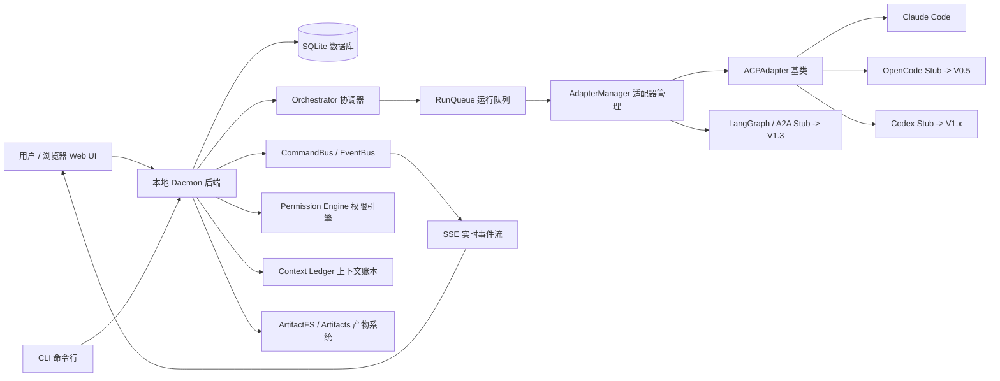
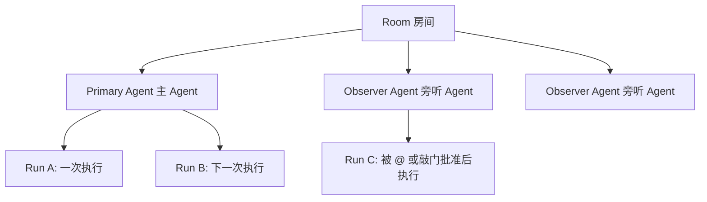
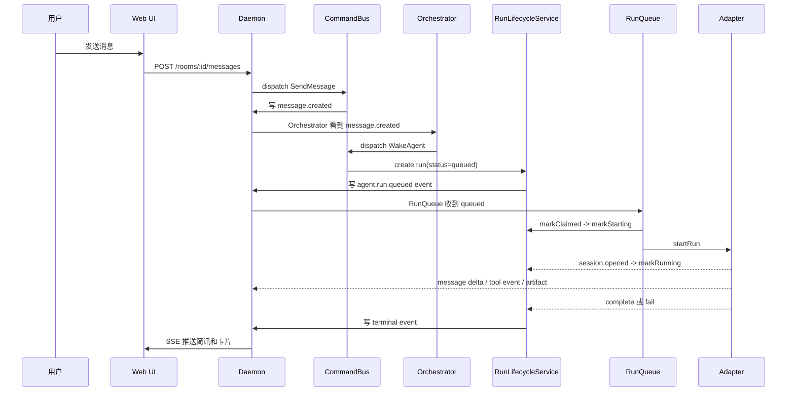
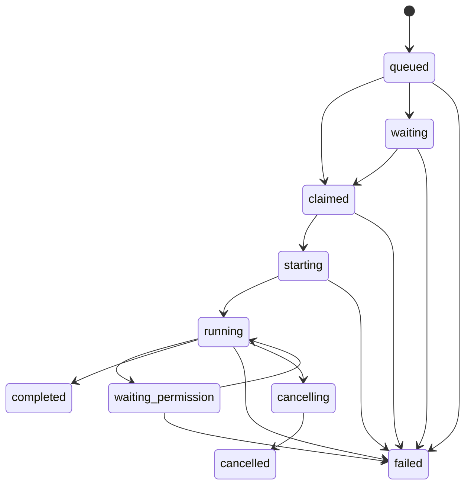
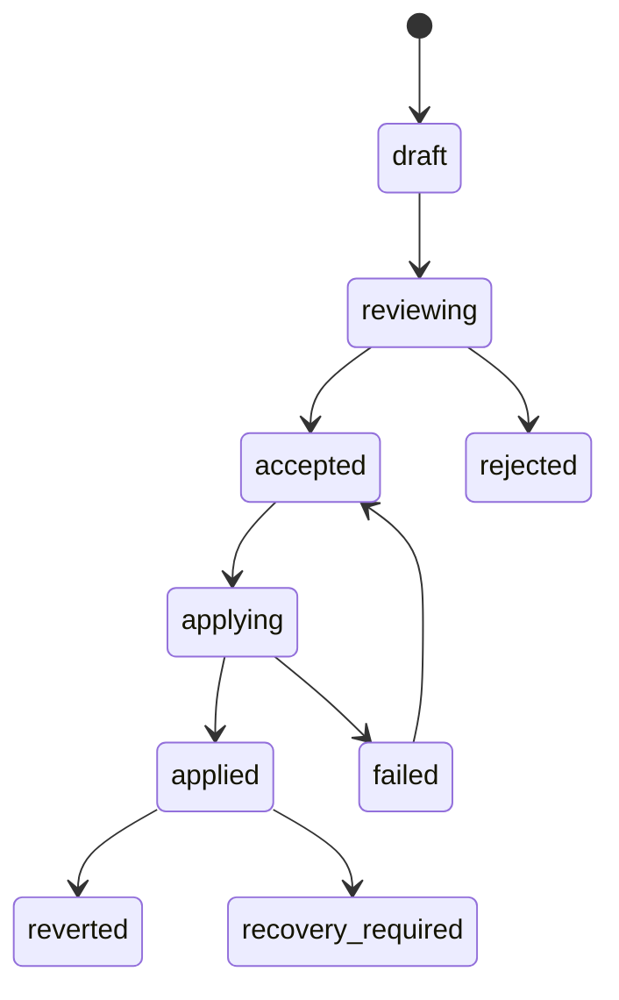

# AgentHub MVP 通俗化设计说明

> 这份文档面向实现前的共识确认。它把 `openspec/changes/add-agenthub-mvp` 下的 proposal、design、tasks 和全部 spec 用更通俗的语言重新讲一遍。  
> 目标不是替代 OpenSpec 原文，而是帮助产品、开发、评审三方理解：这个软件到底要做什么、由哪些模块组成、一次用户请求如何流转、MVP 完成后能用到什么程度、后续应该按什么顺序实现。
>
> **同步状态**：本文已根据 2026-05-23 的大修版 spec 更新，重点同步了本地单机产品红线、V0.5/V1.0/V1.1-V1.5 roadmap、OpenCode/Codex 阶段顺序、MVP 最小 Task 模型、V1.1 Kanban/Timeline、V1.2 Skill/Memory、V1.3 Plugin/A2A 等内容。

## 1. 一句话理解 AgentHub

AgentHub 是一个本地优先的多 Agent 协作工作台。用户像用飞书、微信、Slack 一样创建聊天房间，然后把 Claude Code、Codex、OpenCode 或自建 Agent 当成聊天对象来用。不同的是，这些 Agent 不只是发文字，还会执行代码任务、产出 Diff、请求权限、生成预览、写入上下文，并且所有关键行为都被记录、审计、可回放。

MVP 的核心不是做一个“所有 Agent 自由发言的大群”，而是做一个**有纪律的 IM 式协作系统**：

- 用户可以和一个主 Agent 单聊，让它完成明确任务。
- 用户可以在同一房间里放多个旁听 Agent，但旁听 Agent 默认不能随便插话。
- 旁听 Agent 想介入时要敲门，用户同意后才参与。
- 重型 Coding Agent 适合一次执行完整任务，然后产出一次 Run 级 Diff 给用户审查，而不是每改一个文件都弹一次拦截。
- 群聊主时间线只展示简讯和可操作卡片；完整 token、工具调用、原始日志、上下文细节都放到单个 Run 的详情界面里。

## 2. 先解释几个常见英文术语

| 术语 | 通俗解释 |
|---|---|
| Agent | AI 助手或自动化执行者。这里可以是 Claude Code、Codex、OpenCode，也可以是用户自建的角色。 |
| AgentHub | 这个项目的名字，多 Agent 协作平台。 |
| MVP | Minimum Viable Product，最小可用产品。意思是第一版先做能闭环的核心功能，不做所有未来功能。 |
| V0.5 | MVP 之后的产品完整化阶段。重点做 OpenCode Adapter、Run Detail 完整化、聊天室体验打磨和单机 Cost 面板。 |
| V1.0 | 复杂调度阶段，但仍然是 Web-only。重点做 Squad Mode、Team Mode、静态站点/源码 zip 部署。 |
| V1.x | V1.1 到 V1.5 的持续扩展阶段，按协作可视化、上下文召回、插件生态、多端适配、高级编排逐步展开。 |
| IM | Instant Messaging，即即时通讯。这里指像微信/飞书一样的聊天式交互。 |
| Room | 房间/会话。一个 Room 里有用户、一个主 Agent，以及可选的旁听 Agent。 |
| Solo Mode | 单聊模式。一个用户和一个主 Agent 对话。 |
| Assisted Mode | 辅助模式。一个主 Agent 工作，其他 Agent 旁听、敲门、留言或被用户 @ 唤醒。 |
| Primary Agent | 主 Agent。一个 Room 中负责主要执行任务的 Agent。 |
| Observer Agent | 旁听 Agent。默认只观察，不直接消耗模型调用，也不随便发言。 |
| Orchestrator | 协调器。负责理解消息、解析 @、决定谁被唤醒、执行群聊纪律。 |
| Daemon | 本地后台服务。AgentHub 的后端常驻进程，默认只监听 `127.0.0.1`。 |
| Adapter | 适配器。把 Claude Code、Codex、OpenCode 等外部 Agent 接到 AgentHub 的统一接口层。 |
| ACP | Agent Client Protocol，一类 Agent 客户端协议。spec 计划把 ACP 作为一等运行时协议，Claude/Codex/OpenCode 的 ACP 适配器共享同一个基类。 |
| MCP | Model Context Protocol，模型上下文协议。这里主要用于把 Room 工具暴露给 Agent，例如 `room.read_mailbox`、`room.send_message`。 |
| A2A | Agent-to-Agent，Agent 间互联协议。MVP 只留接口占位，V1.3 做 server + client 双向接入。 |
| Run | 一次 Agent 执行。用户发一条任务后，Agent 从排队、启动、运行到完成/失败/取消，这整个过程就是一个 Run。 |
| Task | 任务。MVP 已有最小 Task 表和状态机，供 Room MCP Tools、未来 Team Mode 和 V1.1 Kanban 复用。 |
| Kanban | 看板。类似 Trello/Linear 的任务面板，V1.1 做，展示 Backlog/In Progress/Waiting/Review/Done 等列。 |
| Timeline | 协作时间线。V1.1 用 traceId 展示多个 Agent 的 wake/run/complete 因果过程。 |
| Squad Mode | 长期 Leader 路由模式。V1.0 做，适合一组固定 Agent 长期协作。 |
| Team Mode | Leader 拆解任务并分派给多个 Agent 的模式。V1.0 做。 |
| War Room | 自由协作型多 Agent 模式。V1.5 做，包含 Leader 仲裁、共识/超时/用户中止等复杂规则。 |
| Skill System | 技能系统。V1.2 做，声明式、无代码执行，类似 Claude Code `.skill`：prompt 片段 + 工具白名单 + 触发条件。 |
| Plugin System | 插件系统。V1.3 做，有代码执行能力，必须 worker/subprocess 隔离、manifest 校验和权限沙箱。 |
| Memory Gateway | 记忆网关。V1.2 做混合记忆，local + 外部 backend 同时启用，按 visibility 路由。 |
| BM25 | 关键词检索算法。V1.2 用 SQLite FTS5 对 confirmed ContextItem 做关键词召回。 |
| Vector Search | 向量检索。V1.2 用 sqlite-vec 接入，替换 MVP 的 NoopVectorIndex。 |
| Tauri | 桌面壳框架。V1.4 做桌面端，AgentHub 不做 Electron。 |
| Responsive Web | 响应式 Web。V1.4 做手机/平板触屏适配和 PWA，不做原生 iOS/Android 客户端。 |
| Command | 命令，请求系统“做一件事”。例如 `WakeAgent`、`CancelRun`。命令可能失败，不一定会成为历史事实。 |
| Event | 事件，已经发生的事实。例如 `message.created`、`agent.run.completed`。事件一旦落库就用于审计和回放。 |
| CommandBus | 命令总线。负责接收命令、做幂等校验、开启事务、调用业务服务。 |
| EventBus | 事件总线。负责发布事件、落库、推送给处理器和浏览器。 |
| Outbox | 事务外盒。业务状态和事件先在同一个数据库事务里提交，再由后台 dispatcher 派发，避免“数据写了但事件丢了”。 |
| Durable Event | 持久事件。会写入数据库，重启后可重放，例如消息创建、Run 完成。 |
| Ephemeral Event | 临时事件。不写数据库，可丢弃或合并，例如 token 流、typing、raw stdout。 |
| SSE | Server-Sent Events，服务器向浏览器持续推送事件的 HTTP 技术。这里用于聊天流实时更新。 |
| Cursor | 游标。客户端或 handler 记录自己消费到第几个事件，下次从那里继续。 |
| Handler | 事件处理器。订阅 durable event 并执行后续动作，例如 RunQueue 收到 `agent.run.queued` 后开始调度。 |
| DLQ | Dead Letter Queue，死信队列。事件处理器多次失败后，把事件放到这里等待人工 Replay 或 Skip。 |
| PubSub | Publish/Subscribe，发布订阅。模块发布事件，订阅者接收感兴趣的事件。 |
| Backpressure | 反压。消费者太慢时系统如何处理，避免内存无限涨。 |
| Effect | TypeScript 的异步/并发/资源管理库。这里用在内核的 Bus、Run、Permission 等复杂异步逻辑。 |
| Hono | 轻量 HTTP 框架。AgentHub 的 HTTP 外壳使用它。 |
| Drizzle | TypeScript ORM/SQL 工具。用于定义 SQLite schema 和 migration。 |
| SQLite WAL | SQLite 的 Write-Ahead Log 模式。提高本地单机读写稳定性。 |
| Schema | 数据结构定义。比如事件 payload 必须有哪些字段。 |
| Migration | 数据库迁移脚本。用于创建表、加字段、加索引。 |
| Envelope | 事件信封。事件外层统一字段，例如事件类型、版本、时间、traceId。 |
| traceId | 追踪一次用户请求的链路 ID。方便 Debug Panel 串起整条流程。 |
| causationId | 因果 ID。表示当前事件由哪个命令或事件导致。 |
| correlationId | 关联 ID。把同一业务目标下的一组事件关联起来。 |
| idempotencyKey | 幂等键。相同请求重复提交时，系统识别为同一次动作，避免重复创建 Run 或重复扣费。 |
| Visibility | 可见性。事件应该出现在主时间线、详情页，还是两边都出现。取值是 `main`、`detail`、`both`。 |
| Artifact | 产物。Agent 生成的 Diff、文件、终端日志、预览等。 |
| Diff | 代码差异。展示“修改前/修改后”，用户审查后再应用。 |
| ArtifactFS | 影子文件系统。Agent 写文件时先写到隔离区域或缓冲区，Run 完成后统一生成 Diff。 |
| Shadow Write | 影子写入。Agent 看起来在写文件，实际上没有直接改真实项目。 |
| Run-Level Diff | Run 级 Diff。一次完整 Run 结束后汇总所有文件变化，而不是每写一次文件就拦截。 |
| Worktree | Git worktree，Git 提供的同一仓库多工作目录机制。适合让重型 Coding Agent 在隔离目录中运行。 |
| Permission Engine | 权限引擎。决定 Agent 的文件读写、shell、工具调用是允许、拒绝还是询问用户。 |
| Deferred | 可等待的异步结果。这里用于权限审批：Agent 暂停等待用户点击允许/拒绝。 |
| Prompt Timeout Pause | Prompt 超时暂停。Agent 等用户审批时，暂停外部 Agent 的 prompt 超时计时，避免用户还没点就失败。 |
| Intervention | 介入/敲门。旁听 Agent 请求插话或给主 Agent 注入建议。 |
| Context Ledger | 上下文账本。保存被用户确认或 Agent 草拟的事实、决策、约束、摘要等。 |
| Context Assembly | 上下文组装。每次唤醒 Agent 前，把相关上下文按规则拼进 prompt。 |
| Prompt | 发给模型的输入。它由用户消息、上下文、角色说明等组合而成。 |
| Liveness | 存活状态。Adapter 或外部 Agent 进程是否可用、忙碌、崩溃。 |
| Heartbeat | 心跳。定期探测连接还活着。SSE 心跳只说明浏览器连接正常，不能说明 Agent 进程正常。 |
| SecretRedactor | 密钥脱敏器。写日志或事件前把 API key 等敏感内容遮掉。 |
| CSRF | Cross-Site Request Forgery，跨站请求伪造。恶意网页可能偷偷向本地 daemon 发 POST，所以本地服务也要防。 |
| Origin / Host | 浏览器请求来源和目标主机头。用于判断请求是不是来自 AgentHub 自己的页面。 |
| Token | 访问令牌。远程访问 daemon 或 CLI 访问时用 Bearer token 鉴权。 |
| OS Keychain | 操作系统密钥库。Windows Credential Locker、macOS Keychain、Linux secret-service。 |
| Prompt Injection | 提示词注入。外部文件或网页里写“忽略之前指令”来诱导模型越权。 |
| JSON-RPC | 一种 JSON 格式的远程调用协议。ACP 使用它传消息。 |
| NDJSON | Newline Delimited JSON，一行一个 JSON。ACP 子进程通过标准输入输出按行通信。 |
| Crash Tombstone | 崩溃墓碑。记录 adapter 崩溃原因，便于恢复和 Debug。 |
| Reclaim | 恢复/认领。daemon 重启后找回崩溃前未完成的 Run 或 session。 |

## 3. AgentHub 的整体架构



可以把系统分成 7 层：

1. Web UI：用户看到的三栏聊天界面、卡片、Run Detail、Debug Panel。
2. Daemon：本地后端，提供 HTTP API、SSE、CLI 管理能力。
3. Bus：CommandBus 和 EventBus，负责所有命令、事件、事务、重试和订阅。
4. Orchestrator：群聊规则和调度入口，决定是否唤醒哪个 Agent。
5. Agent Runtime：RunQueue、RunLifecycleService、AdapterManager，负责启动和管理 Agent Run。
6. Product Services：Rooms、Messages、Context、Permission、Intervention、Artifacts。
7. External Agents：MVP 先接 Mock + Claude Code；OpenCode 是 V0.5 的第二真实 adapter；Codex 推到 V1.x 视需求接入；LangGraph/A2A 在 V1.3 通过插件/远程 adapter 接入。

这版 spec 还有一条非常重要的产品红线：**AgentHub 是单机本地产品，不做 SaaS、云端团队版、多用户认证、Postgres、Redis、WebSocket Hub、Mobile Native Client 或 Marketplace**。后续所有能力都必须在本地 daemon 内实现；多端审批这类需求也只能通过本地 daemon 暴露给 LAN/反向代理解决，而不是引入云后端。

## 4. 这套架构哪些是成熟技术，哪些是自研

| 部分 | 选择 | 性质 | 为什么这样选 |
|---|---|---|---|
| 前端 | Vite + React + TypeScript | 成熟技术 | 本地 Web App 不需要 Next.js 的 SSR 和 SaaS 能力，Vite 更轻。 |
| 后端 HTTP | Hono | 成熟技术 | 轻量，适合作为 TypeScript HTTP 外壳。 |
| 异步内核 | Effect | 成熟技术，但团队需学习 | 用来管理复杂异步、队列、Deferred、Stream、Scope。 |
| 数据库 | SQLite + WAL + Drizzle | 成熟技术 | 本地优先，不要求用户安装 Postgres。 |
| 实时推送 | SSE | 成熟技术 | 浏览器原生支持，适合服务端向前端推事件。 |
| Agent 接入协议 | ACP / MCP | 复用成熟协议 | 不为 Claude/Codex/OpenCode 各自硬写一套私有协议。 |
| CommandBus / EventBus 组合 | 自研，参考成熟模式 | 自研核心 | 采用 Command/Event/Outbox/Handler/DLQ 等成熟设计，但实现会放在项目内。 |
| Orchestrator 群聊纪律 | 自研 | 产品差异点 | 这是 AgentHub 的核心产品逻辑，现成框架很难直接满足。 |
| Context Ledger | 自研，借鉴记忆系统思想 | 产品差异点 | 不是简单 prompt 记忆，而是可审计、可确认、可版本化的上下文账本。 |
| ArtifactFS | 自研，借鉴 worktree/diff 模式 | 产品差异点 | 重点解决重型 Coding Agent 的安全改文件流程。 |
| Permission Engine | 自研，参考 OpenCode 思路 | 自研核心 | ask/allow/deny 是成熟模式，但要适配 AgentHub 的 UI、Run、工具、文件系统。 |
| Debug Panel | 自研 | 工程保障 | 让复杂事件链可见，否则实现期很难排错。 |

这意味着：AgentHub 不是“从零发明所有基础设施”，而是**用成熟技术搭地基，在多 Agent 协作语义上自研**。真正高风险的是自研协调逻辑、Run 生命周期、ArtifactFS、权限和事件一致性，所以 spec 里才花了大量篇幅约束状态机、事务边界和 CI 校验。

## 5. 用户看到的产品形态

MVP 的 Web UI 是三栏结构：

1. 左栏是 Room 列表，类似聊天会话列表，可以创建、归档、切换房间。
2. 中间是主聊天流，只展示用户消息、Agent 简讯、最终结果和需要用户操作的卡片。
3. 右栏或侧滑面板是上下文、任务、Agent Run Detail、权限审批、Debug 等详情。

主聊天流不会像终端日志一样刷屏。复杂细节进入 Run Detail：

- Transcript：完整对话片段。
- Tools：工具调用记录。
- Context：本次 Run 读入或写出的上下文。
- Permissions：审批请求和结果。
- Artifacts：Diff、文件、预览、终端产物。
- Raw Stream：原始流，需要 debug 权限。
- Cost：模型、token、费用字段。

这正好对应之前你提出的产品判断：**群聊界面只展示简讯，点击某个 Agent 的回复后进入它自己的上下文详情界面**。

## 6. Room、Agent、Run 三者的关系



Room 是会话容器。Agent 是房间成员。Run 是某个 Agent 在某个时间段里被唤醒执行的一次任务。

MVP 只真正实现两种模式：

- Solo：只有一个主 Agent，用户发消息后直接进入调度。
- Assisted：一个主 Agent 加多个旁听 Agent。旁听 Agent 默认 observing，不主动烧 token。

Team、Squad、War Room 等更复杂模式会在数据库和类型里预留字段，但运行时返回 501，表示“接口占位，暂未实现”。它们的阶段现在已经拆清楚：Team + Squad 留到 V1.0；War Room 留到 V1.5。

MVP 还会实现一个**最小 Task 模型**，但它不是完整项目管理系统。Task 用来让 `room.create_task` / `room.update_task` / `room.list_tasks` 有真实对象，也为 V1.0 Team Mode 和 V1.1 Kanban 做地基。

Task 的状态是：

```text
pending -> in_progress -> review -> completed
   |           |            |
   v           v            v
blocked     cancelled    cancelled
```

更准确地说：

- `pending`：已创建，未开始。
- `in_progress`：assignee 的 Run 已进入工作状态。
- `blocked`：被权限、用户确认或依赖阻塞。
- `review`：Agent 完成实质工作，等待用户或 leader 确认。
- `completed` / `cancelled`：终态，不能重新激活。

Run 完成不等于 Task 完成。一个 Task 可以产生多次 Run；Run 结束后最多把 Task 推到 `review`，最终 `completed` 要由用户或 leader 确认。任务完成事件也不会叫 `task.completed`，而是统一使用 `task.status.changed { nextStatus: "completed" }`。

## 7. 一条用户消息如何流转



关键点：

1. HTTP route 不直接改业务表，也不直接发事件，而是 dispatch Command。
2. Command 成功后写 durable Event。
3. `WakeAgent` 是模型调用的唯一入口，MVP 没有 `StartRun` Command。
4. RunQueue 根据锁决定是否能启动 Agent。
5. Adapter 不能自己发 `agent.run.completed` 这种核心 Run 事件，必须调用 RunLifecycleService。

## 8. 为什么要区分 Command 和 Event

Command 是“我想做这件事”，Event 是“这件事已经发生”。

举例：

- `CancelRun` 是 Command，因为取消可能失败，比如 Run 已经完成了。
- `agent.run.cancelled` 是 Event，因为它表示取消已经完成，是历史事实。

这样做的好处：

- 可以给 Command 做幂等，避免用户重复点击导致重复执行。
- 可以确保事件只记录真实发生的事实。
- 可以通过 events 表完整回放系统历史。
- 可以避免 HTTP handler 到处直接改数据库，系统边界更清楚。

## 9. 两条“总线”分别干什么

AgentHub 实际上有两条逻辑总线：

1. CommandBus：处理命令。它检查输入、幂等键、权限和事务，最终调用服务方法。
2. EventBus：处理事件。它负责持久化事件、推送 SSE、唤醒 handler、支持回放。

这两条已经够 MVP 用，不需要继续拆成更多业务总线。复杂性主要通过 handler、订阅图、visibility 和 durable/ephemeral 分类来管理。

### durable 和 ephemeral 的区别

| 类型 | 是否落库 | 例子 | 丢了会怎样 |
|---|---|---|---|
| durable | 是 | message.created、agent.run.completed、permission.resolved | 不能丢，丢了就是状态不一致 |
| ephemeral | 否 | token delta、typing、raw stdout chunk | 可以丢或合并，不影响最终事实 |

## 10. Outbox 为什么重要

普通写法容易出现一个危险窗口：

1. 数据库里 message 写成功。
2. 进程崩溃。
3. 事件没发出去。

结果就是数据库有消息，但 UI 和下游 handler 不知道。

Outbox 模式的做法是：业务表、events 表、outbox 表在同一个 SQLite 事务里写入。只要事务成功，重启后 dispatcher 可以从 outbox 继续派发；如果事务失败，三者都不存在。

这就是 spec 一直强调的“domain state + events + outbox 同事务”。

## 11. Run 生命周期

Run 是 AgentHub 最核心的状态机之一。



状态解释：

| 状态 | 含义 |
|---|---|
| queued | Run 已创建，等待调度。 |
| waiting | Run 想启动，但锁被别的 Run 占用。 |
| claimed | RunQueue 已拿到锁，但 adapter session 尚未确认启动。 |
| starting | 正在启动外部 Agent 进程或 session。 |
| running | Agent 正在执行。 |
| waiting_permission | Agent 卡在用户审批上。 |
| cancelling | 用户请求取消，正在同步通知 adapter。 |
| completed | 成功完成。 |
| failed | 失败。 |
| cancelled | 已取消。 |

spec 特别强调 RunLifecycleService 是 `runs` 表唯一写入口。意思是任何模块都不能自己 `UPDATE runs`，必须调用它的方法。这能避免状态机被绕开。

## 12. RunQueue 和锁

RunQueue 是一条命名队列，负责决定哪个 Run 可以启动。

它使用几种锁：

| 锁类型 | 作用 |
|---|---|
| agent 锁 | 同一个 Agent 不同时跑两个 Run。 |
| room 锁 | 某些模式下同一房间内用户触发的 Run 串行。 |
| file 锁 | 两个 Run 声明会改同一个文件时串行。 |
| workspace 锁 | 不知道 targetFiles 时，退化为整个工作区写锁。 |

这符合你之前的判断：重型 Coding Agent 不应该每写一个文件就被拦，而是先跑完整任务；如果不知道它会改哪些文件，就保守锁整个 workspace，任务结束后再审查 Diff。

## 13. observe 为什么必须是被动状态

`observing` 不是“后台持续调用模型观察房间”。它只是一个资格状态，表示 Agent 在房间里旁听，但不会因为消息流动自动烧 token。

真正触发模型调用的唯一入口是 `WakeAgent` Command。

允许触发 wake 的来源包括：

- 用户直接 @ 某个 Agent。
- Orchestrator 规则在阶段边界判断需要某 Agent 参与。
- Agent 敲门后用户 approve。
- 上一轮 Run 完成后有未消费的 next_turn。
- PendingTurn 轮到消费。

不允许的行为：

- Observer 每看到一条消息就调用 API。
- Observer 监听 token delta 自动分析。
- 任意 ephemeral 事件触发模型调用。

这样能控制成本，也能让用户理解“为什么这个 Agent 被叫醒”。

## 14. WakeAgent 是模型调用唯一入口

旧设计里容易出现两条路径：

- 用户消息直接 StartRun。
- Orchestrator WakeAgent 后再 StartRun。

这会造成重复调度、重复扣费、mailbox claim 分叉、activeWakes 失效。现在 spec 明确砍掉 `StartRun` Command。所有模型调用必须走：

```text
WakeAgent -> RunLifecycleService.create -> agent.run.queued -> RunQueue -> AdapterManager.startRun
```

这条路径里会统一处理：

- wakeReason 记录。
- promptDelta 组装。
- mailbox 原子认领。
- activeWakes 去重。
- zero input 拒绝。
- carryNextTurnIds 续接。
- idempotencyKey 幂等。

## 15. Mailbox、run_next_turns 和 read_mailbox

这是最新几轮 spec 修得最细的一块。

### Mailbox 是什么

Mailbox 是持久留言箱。旁听 Agent 或系统想给某个 Agent 留话，但不能直接打断当前 Run，就写进 mailbox。

它必须落 SQLite，不能只存在内存里，否则 daemon 重启会丢消息。

### run_next_turns 是什么

如果一个 Agent 正在跑，用户又发了新输入，或者 Orchestrator 又想追加 promptDelta，就不能直接新建一个 Run，也不能丢掉。于是写入 `run_next_turns`，等待当前 Run 在下一 turn 或结束后续接。

### read_mailbox 做什么

Agent 在自己的 session 里调用 `room.read_mailbox`，一次性读取两类输入：

- mailbox_messages：别人给它的留言。
- run_next_turns：当前 Run 期间追加给它的下一轮输入。

它必须在一个 SQLite IMMEDIATE 事务里完成读取和标记 consumed，防止并发下重复投递。

### deliveryBatchId 是什么

`deliveryBatchId` 是一次投递批次的 ID。相同批次重试时返回同一批内容，新批次只返回新内容。它解决的问题是：网络抖动或 ACP tool 重试时，Agent 不应该重复看到同一段 mailbox，导致上下文膨胀。

## 16. activeWakes 防重入

同一个 Room + Agent 已经有活跃 wake 或 active run 时，新的 wake 不应该创建第二个 Run，而应该把输入追加到 `run_next_turns`。

spec 同时使用两层防线：

1. 进程内 activeWakes guard，挡住同进程并发。
2. 数据库级 `runRepo.findActive(tx, roomId, agentId)` 二次校验，挡住进程重启或 race condition。

guard 必须 try/finally 释放，避免拒绝路径泄漏。

## 17. Adapter 设计

Adapter 是 AgentHub 接外部 Agent 的边界。它要解决三个问题：

1. 不同 Agent 的启动方式不同。
2. 不同 Agent 支持的事件能力不同。
3. 不同 Agent 的崩溃恢复能力不同。

所以每个 Adapter 都要声明 manifest，也就是能力清单：

- 是否能流式输出 token。
- 是否能发工具调用事件。
- 是否能发权限请求事件。
- 是否能注入上下文。
- 是否支持取消。
- 是否支持恢复 session。
- 使用 worktree、copy、shadow buffer 还是外部工作区。

UI 和 Orchestrator 必须诚实展示这些差异，不能让 Codex 假装支持 Claude Code 才有的 hook。

当前 adapter 阶段顺序已经确定：

| 阶段 | Adapter 策略 |
|---|---|
| MVP | `MockAgentAdapter` + `ClaudeCodeAdapter` |
| V0.5 | `OpenCodeAdapter`，作为第二真实 adapter，优先验证结构化 server/SDK 路径 |
| V1.3 | `LangGraphAdapter` + `RemoteA2AAdapter`，依赖 plugin-system 隔离基座 |
| V1.x | `CodexAdapter` 视需求接入，因为 Codex 事件更弱，不能让它过早牵动主抽象 |

## 18. ACPAdapter 为什么重要

ACPAdapter 是统一接入 ACP 协议的基类。Claude Code、Codex、OpenCode 如果都支持 ACP，就不应该各自写一套状态机，而是继承同一个 ACPAdapter，只覆盖：

- 如何 detect CLI。
- 如何 spawn 子进程。
- 如何映射 provider 特有事件。
- 如何映射 provider 特有错误。

ACPAdapter 固定处理：

- NDJSON over stdin/stdout。
- JSON-RPC pending request 表。
- 每 session 同时只允许一个 prompt in-flight。
- cancel 和 dispose 分离。
- session.opened 后持久化 adapterSessionId 和 workDir。
- raw stdout/stderr 限流和分流。

这能显著降低后续接 OpenCode、Codex、LangGraph 或 A2A 远程 Agent 的复杂度。MVP 只要求这些后续 adapter 有 stub：`detect()` 返回空、`startRun()` 返回 not implemented；不要提前实现真实能力。

## 19. Context Ledger 不是 Prompt

Context Ledger 是上下文账本，不是直接塞给模型的 prompt。

账本保存的是结构化事实：

- fact：事实。
- decision：决策。
- constraint：约束。
- issue：问题。
- artifact：产物引用。
- preference：偏好。
- summary：摘要。

每条 ContextItem 有状态：

- draft：草稿，Agent 可以提出。
- confirmed：已确认，通常需要用户确认或可信系统工具写入。
- deprecated：废弃。
- disputed：有争议。

每次唤醒 Agent 前，Context Assembly 会从账本里按规则选出相关内容，组装成 prompt。这样可以避免“所有历史消息一股脑塞进模型”，也能知道某个结论是谁提出、谁确认、什么时候改变。

## 20. Permission Engine 怎么保护用户

Permission Engine 使用 `allow / ask / deny` 三档：

- allow：直接允许。
- ask：暂停 Run，弹卡给用户确认。
- deny：直接拒绝，并把原因回传给 Agent。

默认敏感文件拒绝，例如：

- `.env`
- 私钥文件。
- `.ssh/**`
- `.aws/**`
- `.gcp/**`

审批粒度不是“每个文件每次都弹”，而是分成：

- 项目内。
- 项目外。
- 敏感。

用户可以选择“本项目总是允许”，减少审批疲劳。

同一个 adapter session 的多个权限请求要串行弹卡；同一个 toolCallId 重试不能覆盖原 Deferred；等待审批时要暂停 prompt timeout。

## 21. Intervention：旁听 Agent 如何敲门

Intervention 是 AgentHub 的差异化核心之一。旁听 Agent 不能直接插话，但可以请求介入。

状态流：

```text
requested -> pending_user_decision
  -> approve -> injected -> resolved
  -> ignore -> closed
  -> reject -> closed
  -> later -> snoozed -> pending_user_decision
```

用户看到 Intervention Card，可以选择：

- approve：允许，并可修改注入文本。
- later：稍后提醒。
- ignore：忽略。
- reject：拒绝。

approve 后系统按 Adapter 的 injectionMode 决定马上注入、下一 turn 注入，还是下一 session 才生效。

## 22. Artifact 和 Diff 的设计

AgentHub 不让 Agent 直接改真实工作区。正确流程是：

```text
Agent 写文件 -> ArtifactFS 捕获 -> Run 完成 -> 生成 DiffArtifact -> 用户审查 -> Permission 通过 -> ArtifactApplier 写真实文件
```

DiffArtifact 状态大致是：



重要约束：

- 多文件 apply 尽量事务化，失败要回滚。
- apply 前检查 oldSha256，文件被外部修改则 stale_base，不直接覆盖。
- applied 后不能再变 failed。
- oldContent 至少保留 30 天，支持回滚。
- 失败 Run 也可以生成 artifact 给用户审查。

## 23. ArtifactFS 的几种模式

| 模式 | 解释 | 适合谁 |
|---|---|---|
| isolated_worktree | 用 Git worktree 创建隔离目录，Agent 在里面真实写文件，结束后 git diff。 | 重型 Coding Agent，推荐默认。 |
| isolated_copy | 复制一份项目目录让 Agent 改。 | 非 Git 项目或特殊场景。 |
| shadow_buffer | 写入被截获到内存 Map，不落真实磁盘。 | 不需要 shell 的轻量 Agent。 |
| shared | 直接共享真实工作区。 | 仅测试/调试，UI 必须红色警告。 |

spec 明确：terminal-enabled agent 不能用 shadow_buffer，因为 shell 重定向 `> file` 无法被内存 buffer 可靠拦截。

## 24. Web Preview 如何保证安全

Agent 生成的 HTML/Markdown 预览要放进 iframe，但不能和 daemon API 同源。

要求：

- preview 服务使用独立端口，例如 daemon 是 `127.0.0.1:6677`，preview 是 `127.0.0.1:6678`。
- iframe sandbox 只允许 `allow-scripts`。
- 不允许 `allow-same-origin`。
- preview token 一次性，短期有效。
- preview 不带 daemon cookie。
- data URI 和 file URI 都走统一安全解析。

这样即使 Agent 生成的 HTML 里有脚本，也不能读取 daemon API 或用户 token。

## 25. 主流摘要和 Run Detail 双投影

同一条事件可能有不同可见性：

- `main`：主聊天流可见。
- `detail`：只在 Run Detail 可见。
- `both`：两边都可见。

比如：

- 用户消息：main 或 both。
- Agent brief：main。
- token delta：detail 或 ephemeral。
- raw stdout：raw debug。
- permission card：main/both，取决于是否需要用户立即操作。

SSE 支持 `?view=main|detail|raw`，daemon 按 visibility 过滤。这样主聊天不会被原始日志和工具流淹没。

## 26. PendingTurn：Agent 忙时用户还能继续发消息

用户在主 Agent 忙的时候继续发消息，系统不应该阻止，也不应该马上启动第二个 Run。

做法：

1. 消息照常创建。
2. `turn_dispatch_mode='pending'`。
3. 创建 PendingTurn。
4. UI 显示排队中。
5. 当前 Run 结束后，Orchestrator 先处理未消费 next_turn，再消费 PendingTurn。

排队上限是 20，接近上限 UI 要提示，超过则拒绝。

## 27. Observability 和 Debug Panel

Debug Panel 的目标是：开发者 5 分钟内能知道“为什么这条消息没回复”。

它需要支持：

- 按时间线看 durable events。
- 按 traceId 看完整链路。
- 按 runId 看单次 Run 的所有事件。
- 查看 adapter raw stdout/stderr 日志。
- 处理 DLQ：Replay 或 Skip。
- 查看 handler.stalled。

MVP 不上 Jaeger、Tempo、OpenTelemetry exporter，先做内置 Debug Panel。

## 28. Security 安全设计

MVP 的安全原则：

1. 本地优先，默认只绑定 `127.0.0.1`。
2. 远程访问必须显式开启 token。
3. API key 不进 SQLite 明文，只存在 OS keychain。
4. 浏览器 mutating 请求要校验 Origin/Host/CSRF。
5. SSE GET 不要求自定义 CSRF header，因为原生 EventSource 不支持自定义 header，但必须校验 cookie + Origin/Host。
6. bootstrap `/auth/session` 是唯一 CSRF/cookie 豁免，但仍要 Origin 白名单和 JSON Content-Type。
7. Agent 子进程不继承 daemon 的密钥环境变量。
8. 所有日志、事件、错误响应都经过 SecretRedactor。
9. 文件路径必须 canonicalize，禁止 `..` 和 symlink 越界。
10. Debug raw log 需要 admin 或本地 debug.enabled。

## 29. 各个 spec 模块的通俗化说明

### local-daemon

定义本地后台服务怎么启动、监听端口、优雅停止、提供健康检查、OpenAPI、SDK 和 SSE。它是整个系统的外壳。MVP 默认 `127.0.0.1`，远程访问必须显式开 token。

### event-system

定义事件协议。所有 durable 事件都有统一 envelope、schemaVersion、seq、traceId。ephemeral 事件不落库，用于高频流。SSE 重连只依赖 durable seq，不被 ephemeral 影响。

### bus-runtime

定义 CommandBus、EventBus、Outbox、Durable Handler、DLQ、RunQueue、反压、订阅图谱和启动/关闭顺序。它是系统一致性的核心。

### rooms

定义房间、参与者、Solo/Assisted 模式、房间归档、多 tab 同步和群聊纪律。MVP 只实现 Solo 和 Assisted；Team + Squad 留 V1.0；War Room 留 V1.5。

### messaging

定义消息、消息片段、附件、卡片、delta 合流、引用、重生成、Pin、删除、PendingTurn、主流摘要和 Run Detail 双视图。

### agents

定义 AgentProfile、AgentPresence、Agent 能力、Run 生命周期、内置 Agent 模板、Run 状态扩展、sessionId/workDir 持久化和失败分类。

### adapter-framework

定义统一 Adapter 接口、manifest 能力声明、MockAdapter、ClaudeCodeAdapter、ACPAdapter、子进程隔离、崩溃恢复、CLI 探测、raw 输出限流、liveness 和配置更新事件。

### orchestrator

定义调度策略、@ 解析、Room MCP Tools、Mailbox、WakeAgent 单一入口、observing 被动语义、activeWakes、run_next_turns 和 `room.read_mailbox` 原子消费。大修后还补了 MVP 最小 Task 数据模型：`tasks` 表、`Task.status` 状态机、Task 和 Run 的关系、TaskCard 投影、`task.status.changed` 事件契约。这让 V1.0 Team Mode 和 V1.1 Kanban 不需要临时发明任务模型。

### permissions

定义权限 profile、敏感文件默认拒绝、ask/allow/deny、Deferred 审批、路径三档、shell glob 匹配、remember 规则、permission API、per-session 串行和 prompt timeout pause。

### interventions

定义旁听 Agent 敲门介入的状态机、去重、API、UI 排序、审计和状态联动。

### context-ledger

定义上下文账本、ContextItem 数据模型、版本乐观锁、Pin、可见性矩阵、Context Assembly v0、注入三档、MCP context tools、可信系统工具白名单和 V1.2 向量接口占位。MVP 只有规则召回；BM25、sqlite-vec 和混合记忆都留到 V1.2。

### artifacts

定义产物模型、Diff 状态机、Diff 应用与回滚、多 Agent 改同文件互斥、文件产物、终端产物、预览产物、部署占位、Artifact API 和 ArtifactFS Shadow Write。

### web-ui

定义三栏布局、客户端 Projector、消息虚拟化、delta 渲染节流、卡片组件、输入框 @ 补全、Side Panel、房间未读、错误重连、Diff UI、Run Detail 和 PendingTurn UI。

### observability

定义 Debug Panel、traceId/causationId/correlationId、pino 结构化日志、adapter raw stream 持久化、events 检索 API、Cost 字段和健康指标端点。

### security

定义本地绑定、CSRF/Origin/Host、token、OS keychain、敏感文件、prompt injection 防护、子进程隔离、路径校验、日志脱敏、URI 安全、debug 授权和 preview iframe sandbox。

### v1-roadmap

定义 MVP 不做但要预留的接口。当前路线已经不再是“笼统 V1”，而是分阶段推进：

- **V0.5**：多 Agent 聊天室完整化，做 OpenCode Adapter、Run Detail 7 tab 完整化、聊天室体验打磨和单机 Cost 面板。
- **V1.0**：复杂调度，Web-only，做 Squad Mode、Team Mode、static/zip deploy。
- **V1.1**：协作可视化，做 `task-board` 和 Timeline；Topology/Dependency 视图顺延到 V1.1 末尾或 V1.2。
- **V1.2**：上下文真生效，做 Skill System、BM25、Vector Search、Memory Gateway 混合记忆。
- **V1.3**：生态打开，做 Plugin System、LangGraph Adapter、A2A Server + Client。
- **V1.4**：多端适配，做 Tauri 桌面壳、响应式 Web/PWA、Docker Deploy、前端美化轮次 2。
- **V1.5**：高级编排，做 War Room Mode 和 Permission DSL。

同时明确不做：SaaS、云端团队版、多用户认证、Postgres、Redis、WebSocket Hub、Mobile Native Client、Marketplace。

## 30. MVP 开发完成后大概能完成哪些功能

完成 MVP 后，用户应该能做到：

1. 启动本地 AgentHub daemon。
2. 打开 Web UI。
3. 创建 Solo Room，与一个 Agent 单聊。
4. 创建 Assisted Room，设置一个主 Agent 和若干旁听 Agent。
5. 发送消息、引用消息、删除自己的消息、重生成 assistant 回复。
6. 在主 Agent 忙时继续发消息，看到 PendingTurn 排队。
7. @ 某个旁听 Agent，让它临时参与。
8. 旁听 Agent 通过 Intervention 敲门，用户 approve/reject/later/ignore。
9. Agent 调用 Room MCP Tools 读取上下文、发送 mailbox、读取 mailbox。
10. 通过 MockAgentAdapter 跑通完整协作闭环，不依赖外部 Agent。
11. 通过首个真实 Adapter 接入 Claude Code 或 Claude Code ACP 路径。
12. 看到 Agent 的简讯、阶段状态、最终结果。
13. 点击简讯进入 Run Detail，看完整上下文、工具、权限、产物、日志、成本。
14. 对文件修改看到 Diff Card。
15. 接受 Diff 后由系统应用到真实工作区。
16. 在文件已变化时看到 stale_base 冲突，而不是被覆盖。
17. 对已应用 Diff 在保留期内回滚。
18. 处理权限审批：文件读写、shell、tool、context、agent 操作。
19. 使用“本项目总是允许”减少重复审批。
20. 使用 Context Ledger 记录 confirmed/draft 上下文。
21. Pin 关键上下文，让后续 Run 自动带上。
22. 查看 Debug Panel，按 traceId/runId 排查问题。
23. daemon 重启后恢复 durable 事件、outbox、handler 游标和部分 Run 状态。
24. 慢客户端断线后用 Last-Event-ID catch-up。
25. raw stdout 暴涨时不会拖垮主聊天流。
26. 使用 preview iframe 安全预览简单 HTML/Markdown/image。
27. 默认本地安全运行，远程访问需要 token。
28. 使用 MVP 最小 Task 模型创建、更新、列出任务，并通过 TaskCard 在主流引用一次。
29. 通过 `task.status.changed { nextStatus: "completed" }` 表示任务完成，而不是新增 `task.completed` 事件。
30. 对 OpenCode、Codex、LangGraph、A2A 等后续 adapter 提供 stub，明确返回 501 或 detect 空结果。

MVP 不会完成：

- **V0.5 才做**：OpenCode Adapter、Run Detail 7 tab 完整化、聊天室体验打磨、单机 Cost 面板。
- **V1.0 才做**：Team Mode、Squad Mode、static/zip deploy。MVP 不做复杂 Leader 调度。
- **V1.1 才做**：Kanban task-board 和协作 Timeline。MVP 只有最小 Task 模型，不做完整看板。
- **V1.2 才做**：Skill System、BM25、Vector Search、Memory Gateway 混合记忆。
- **V1.3 才做**：Plugin System、LangGraph Adapter、A2A Server + Client。
- **V1.4 才做**：Tauri 桌面壳、响应式 Web/PWA、Docker Deploy、前端美化轮次 2。
- **V1.5 才做**：War Room Mode、Permission DSL、预算告警/降级策略。
- **永不做**：SaaS、云端团队版、多用户认证、Postgres、Redis、WebSocket Hub、Mobile Native Client、Marketplace。

## 31. 实现顺序建议

tasks.md 已给出 M0-M6。更通俗地说，建议按下面顺序做。

### M0：先把地基打稳

目标：仓库、数据库、协议、事件系统、CommandBus、五道 CI。

必须先做：

- monorepo。
- TypeScript 配置。
- SQLite migration。
- EventEnvelope。
- Command union。
- `events:check`。
- `visibility:check`。
- `subscriptions:check`。
- `command:check`。
- `run-state-machine:check`。

原因：这套 spec 的一致性太复杂，CI 不先建，后面会靠人肉记忆，很快失控。

### M1：跑通最小 Agent 执行闭环

目标：Room + Message + RunLifecycle + RunQueue + MockAdapter golden path。

能做到：

- 用户发消息。
- 创建 Run。
- RunQueue 启动 MockAgent。
- MockAgent 输出消息。
- Run completed。
- UI 或测试能看到事件链。

### M2：加入权限、介入、上下文和 Debug

目标：让系统变得可控、可解释。

实现：

- Permission Engine。
- Intervention Engine。
- Context Ledger。
- Context Assembly v0。
- Debug Panel v0。

这一步之后，Agent 不再只是“能跑”，而是“用户能管理它”。

### M3：实现 ArtifactFS 和 Run-Level Diff

目标：让 Coding Agent 安全地产出代码修改。

实现：

- isolated_worktree / isolated_copy / shadow_buffer。
- Run 完成生成 DiffArtifact。
- DiffCard。
- Apply/Revert。
- file/workspace 锁。
- stale_base 检测。

这是 AgentHub 作为 Coding Agent 协作平台的关键里程碑。

### M4：完善 Web UI 产品体验

目标：让用户真的像 IM 一样使用。

实现：

- 三栏布局。
- 主流摘要。
- Run Detail 七个 tab。
- PendingTurn UI。
- PermissionCard。
- InterventionCard。
- DiffCard。
- 多 tab 同步。
- 断线重连。

### M5：接入真实 ACP/Claude Code Adapter

目标：从 Mock 进入真实 Agent。

实现：

- ACPAdapter 基类。
- JSON-RPC pending 表。
- cancel/dispose。
- session.opened 两步持久化。
- ClaudeCodeAdapter。
- CLI detect/spawn。
- provider error mapping。

OpenCode / Codex / LangGraph / A2A 先保留 stub：`detect()` 返回空、`startRun()` 返回 not implemented。OpenCode 是 V0.5 的第二真实 adapter；Codex 推到 V1.x；LangGraph/A2A 留到 V1.3。

### M6：安全、恢复和运维加固

目标：让系统抗崩溃、抗误用、可长期运行。

实现：

- ReclaimStaleClaimedRun。
- Worktree GC。
- Adapter liveness。
- raw stream 分流。
- SecretRedactor。
- CSRF/Origin/Host。
- token/keychain。
- preview 独立 origin。
- debug 授权。

## 32. MVP 之后的路线图

MVP 不是终点，但后续路线已经明确收敛为**本地单机产品继续增强**，不是走云端团队版。

| 阶段 | 主题 | 主要交付 | 不做什么 |
|---|---|---|---|
| V0.5 | 多 Agent 聊天室完整化 | OpenCode Adapter、Run Detail 7 tab、聊天室体验打磨、单机 Cost 面板 | 不做复杂调度、不做 Memory/Vector |
| V1.0 | 复杂调度（Web-only） | Squad Mode、Team Mode、static/zip deploy | 不做桌面壳、不做 A2A、不做 War Room |
| V1.1 | 协作可视化 | Kanban task-board、Timeline、task.column/priority/assignee 事件 | Topology/Dependency 可顺延 |
| V1.2 | 上下文真生效 | Skill System、BM25、sqlite-vec、Memory Gateway 混合记忆、Topology/Dependency | 不做 Plugin/LangGraph |
| V1.3 | 生态打开 | Plugin System、LangGraph Adapter、A2A Server + Client | 不做桌面壳/Docker |
| V1.4 | 多端适配 | Tauri、响应式 Web/PWA、Docker Deploy、前端美化 | 不做原生移动端/Electron |
| V1.5 | 高级编排 | War Room Mode、Permission DSL | 不再预设云端路线 |

几个关键决策：

- 第二真实 adapter 选 **OpenCode**，不是 Codex。
- Codex 推到 V1.x，等主路径稳定后再决定具体阶段。
- Plugin 和 Skill 拆开：Skill 无代码执行，V1.2；Plugin 有代码执行，V1.3。
- Memory 采用混合记忆方向：local + 外部 backend，外部 backend 在 V1.2 开工前再定 Mem0 还是 ReMe。
- A2A 做 server + client 双向，但放到 V1.3。
- 桌面壳用 Tauri，不做 Electron。
- 移动体验走响应式 Web + PWA，不做 Native iOS/Android。
- 团队云端、SaaS、Marketplace、Postgres、Redis、WebSocket Hub、Mobile Native Client 都不做。

## 33. 实现期最容易踩的坑

1. 不要绕过 CommandBus 直接写业务表。
2. 不要绕过 RunLifecycleService 直接更新 runs。
3. 不要让 Adapter 直接 publish `agent.run.*`。
4. 不要恢复 `StartRun` Command。
5. 不要让 observing Agent 因普通事件自动调用模型。
6. 不要每次文件写入都弹审批；重型 Agent 要 Run 完成后看 Diff。
7. 不要把 raw stdout 推进主聊天流。
8. 不要把 absolute path 暴露给普通 API/SSE。
9. 不要让 `deliveryBatchId` 每次随机生成，否则 read_mailbox 幂等失效。
10. 不要用 `UNIQUE(claimed_run_id)`，同一个 run 可以 claim 多条 mailbox。
11. 不要在 preview iframe 上加 `allow-same-origin`。
12. 不要把 API key 存 SQLite 明文。
13. 不要把 handler retry 和 Run retry 混在一起。
14. 不要用 `rm -rf` 清理 git worktree，要用 `git worktree remove`。
15. 不要让 `shadow_buffer` 搭配 shell/terminal。

## 34. 推荐的第一批验收用例

1. observe 不烧 token：100 条 message 流过，observer LLM 调用次数为 0。
2. WakeAgent 单入口：全仓不存在 dispatch `StartRun`。
3. Command 幂等：同 key 同 body 重试只执行一次。
4. Outbox 恢复：事务提交后立刻 kill daemon，重启能派发事件。
5. Run 状态机：queued -> claimed -> starting -> running -> completed。
6. claimed 崩溃：重启后 fail transient，锁释放。
7. starting + sessionId 崩溃：重启后 reclaim attach，不重复启动 session。
8. workspace/file 锁互斥：workspace 锁存在时 file 锁阻塞，反之亦然。
9. activeWakes：同 Agent 忙时新 wake appendNextTurn，不创建空 Run。
10. read_mailbox 幂等：同 deliveryBatchId 重试返回同一 batch，新 batch 不返回旧输入。
11. carryNextTurnIds：run_A 完成后 next_turn rebind 到 run_B。
12. transient fail：mailbox 回滚并清 delivery_batch_id，新 run 能读到。
13. permission per-session：同 session 两个 tool request 串行弹卡。
14. ArtifactFS read-after-write：Agent 写后再读能读到新内容。
15. Run-Level Diff：一个重型任务改 4 个文件，只生成一次 DiffCard。
16. preview 安全：iframe 无 same-origin，不能 fetch daemon API。
17. raw stream 暴涨：主流 SSE 不被阻塞。
18. 多 tab：一个 tab 看 main，一个看 detail，状态一致。

## 35. 当前仓库与 spec 状态

当前仓库已经建立 Git 仓库。OpenSpec 变更名为：

```text
add-agenthub-mvp
```

当前 strict 校验命令：

```powershell
openspec.cmd validate add-agenthub-mvp --strict
```

截至本文生成时，校验结果为：

```text
Change 'add-agenthub-mvp' is valid
```

## 36. 最后的产品判断

这版 spec 已经不只是“做一个多 Agent 聊天 UI”，而是在设计一个本地优先、可审计、可恢复、可控权限、可安全改代码的 Agent 协作运行时。

它的 MVP 重点是：

- 单聊和旁听协作体验闭环。
- WakeAgent 单一模型调用入口。
- RunLifecycleService 和 RunQueue 保证执行有序。
- Mailbox/run_next_turns 保证输入不丢、不重复。
- ArtifactFS + Run-Level Diff 解决重型 Coding Agent 安全写代码。
- Permission/Intervention/Context 让用户能控制和沉淀 Agent 的行为。
- Debug Panel 和 CI 自检让复杂系统可实现、可排错。

后续实现时，最重要的工程策略是：**先让内核约束跑起来，再做漂亮 UI；先用 MockAdapter 跑完整闭环，再接真实 Claude Code；MVP 稳定后再做 V0.5 OpenCode，Codex 不要过早牵动核心抽象。**
